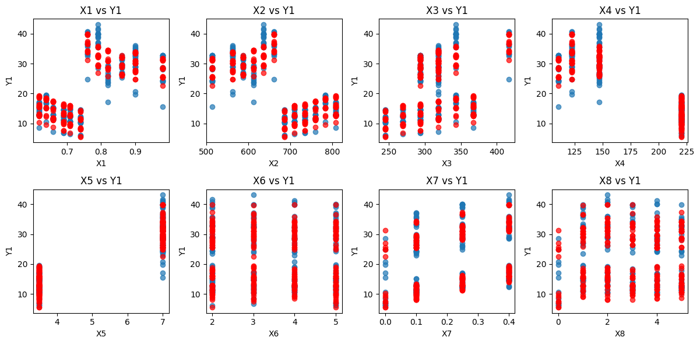
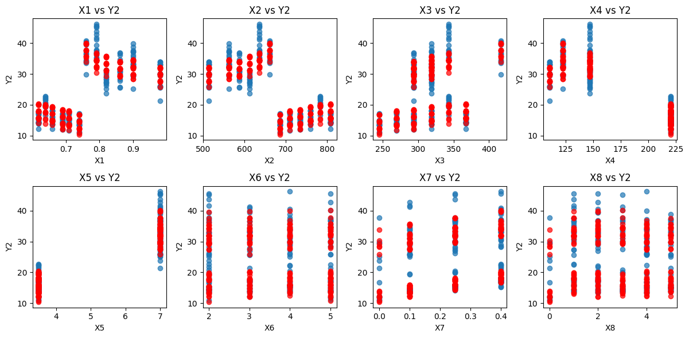
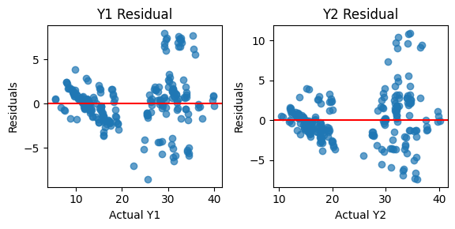
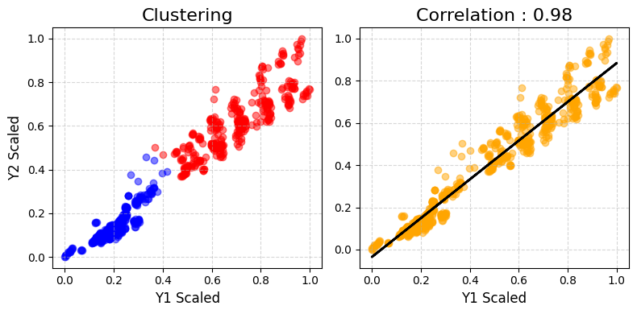

# Predictive Modeling of Heating and Cooling Loads (In Progress🧑‍💻)

This project will denote parameters such as glazing area, orientation, etc., as (Xi), and targets such as heating load and cooling load as (Yi). Below shows the notation we will be using:

| Name | Role   | Description               |
|------|--------|---------------------------|
| X1   | Feature| Relative Compactness      |
| X2   | Feature| Surface Area              |
| X3   | Feature| Wall Area                 |
| X4   | Feature| Roof Area                 |
| X5   | Feature| Overall Height            |
| X6   | Feature| Orientation               |
| X7   | Feature| Glazing Area              |
| X8   | Feature| Glazing Area Distribution |
| Y1   | Target | Heating Load              |
| Y2   | Target | Cooling Load              |

# Regression model 
The equation for multi-dimensional (or multiple) linear regression can be written as:

$$
y = \beta_0 + \beta_1 x_1 + \beta_2 x_2 + \dots + \beta_n x_n + \epsilon
$$

Where:

- $\( y \)$ is the dependent variable (target),
- $\( \beta_0 \)$ is the intercept,
- $\( \beta_1, \beta_2, \dots, \beta_n \)$ are the regression coefficients (weights) for the independent variables,
- $\( x_1, x_2, \dots, x_n \)$ are the independent variables (features) such as Relative Compactness, Surface Area, Wall Area
- $\( \epsilon \)$ is the error term (residuals).

After applying this model we get the below prediction plots: 

looking over the residuals: 

  

The residual plots for Y1 and Y2 suggest patterns rather than random scatter, indicating potential issues with model assumptions. The clustering of residuals hints at non-linearity or heteroscedasticity, where errors vary across different actual values. The red reference line at zero helps visualize systematic deviations, suggesting the model may not fully capture underlying trends. For now we have $R^2 = 0.9118$

# More EDA

  

Only lokking over our target variable we observe a strong linear relationship however when we dig deeper and apply clustering over Y1 and Y2 we observe that the data behaves differently for.....

## References and Data Sources 📖

Below are links to all the resources I used in developing this project.

- The data for this project is sourced from [UCI Machine Learning Repository](https://archive.ics.uci.edu/datasets), a platform offering publicly accessible datasets, including those related to building energy efficiency. The dataset includes details on heating and cooling loads, glazing area, and orientation, among other parameters.

Dataset URL: [UCI Building Energy Dataset](https://archive.ics.uci.edu/dataset/242/energy+efficiency)
